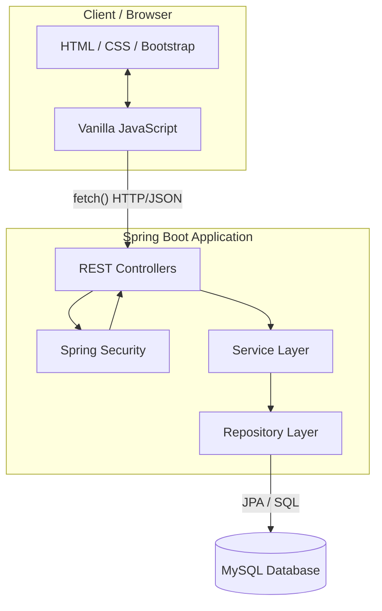

```markdown
# 1. Architecture Overview

The **Steep & Sip** Tea E-Commerce Platform is designed as a **Modular Monolith + Client-Server REST Architecture**.

- **Frontend:** A static HTML/CSS/Vanilla JS client executing in the browser.
- **Backend:** A single, unified Java Spring Boot application (Modular Monolith) exposing REST APIs.
- **Database:** A single MySQL relational database.
- **Deployment Model (High Level):** The backend runs on an embedded Tomcat server. The frontend can be served statically by Spring Boot (e.g., from `src/main/resources/static`) or hosted independently (e.g., GitHub Pages).

**Why this architecture?**
This architecture enforces a strict decoupling between the user interface and the business logic without the operational overhead of microservices. It allows for rapid, testable development suitable for a solo B.C.A. student project while demonstrating enterprise-grade N-Tier separation and RESTful API design.

---

# 2. Architecture Goals and Principles

1. **Separation of Concerns:** UI rendering (Frontend) is completely divorced from data processing (Backend).
2. **Layered N-Tier Backend:** Requests flow strictly downwards: Controller → Service → Repository. Upward traversal is forbidden.
3. **Single Responsibility:** A class should have one primary reason to change (e.g., `OrderService` handles only order workflows, not user authentication).
4. **Server-Side Authority:** The browser is an untrusted client. All critical calculations (pricing, totals, inventory) must be performed by the backend.
5. **Transactional Integrity:** Operations spanning multiple database tables (e.g., Checkout) must be atomic.
6. **API Contract Stability:** The REST API acts as the rigid boundary between frontend and backend.
7. **Security by Design:** Authentication and authorization are enforced at the API boundary before business logic executes.
8. **Incremental Development:** The architecture supports building vertical slices (e.g., Product Catalog) before tackling complex domains (e.g., Checkout).

---

# 3. Technology Stack

| Layer | Technology | Target | Responsibility | Required/Optional |
|---|---|---|---|---|
| **Backend Core** | Java | JDK 17+ | Primary programming language | Required |
| **Backend Framework** | Spring Boot | 3.x | Auto-configuration, embedded server, dependency injection | Required |
| **Web / API** | Spring Web (MVC) | REST | HTTP routing, JSON serialization/deserialization | Required |
| **Security** | Spring Security | Session | Authentication, authorization, BCrypt, CSRF protection | Required |
| **Persistence** | Spring Data JPA / Hibernate | - | ORM, abstraction of database operations | Required |
| **Database** | MySQL | 8.x | Relational data storage | Required |
| **Frontend UI** | HTML5 / CSS3 / Bootstrap 5 | - | Structure and styling | Required |
| **Frontend Logic**| Vanilla JavaScript (ES6) | `fetch()` | DOM manipulation, API consumption | Required |
| **Build Tool** | Maven | - | Dependency management, build lifecycle | Required |
| **Testing** | JUnit 5 / Mockito | - | Unit and integration testing | Required |
| **Direct DB Access**| JDBC | - | Complex analytical queries bypassing JPA | Optional |

---

# 4. High-Level System Architecture



---

# 5. Request/Response Flow

The standard lifecycle of a client request is strictly defined:

1. **Browser:** JavaScript captures a user action (e.g., "Add to Cart") and executes a `fetch()` request containing JSON payload.
2. **Security Filter Chain:** Spring Security intercepts the request to verify the session cookie and role authorization.
3. **REST Controller:** Receives the HTTP request, extracts path variables/request bodies, and maps JSON to a Request DTO.
4. **Service Layer:** The Controller calls the appropriate Service method. The Service executes business logic (e.g., checking inventory).
5. **Repository Layer:** The Service calls the Repository to read/write Entities via Spring Data JPA.
6. **Database:** Hibernate translates JPA calls into MySQL queries.
7. **Service/DTO Mapping:** The Service returns data (often mapping internal Entities to Response DTOs to hide sensitive fields).
8. **REST Controller:** Wraps the DTO in a `ResponseEntity` with the appropriate HTTP status code (e.g., `200 OK`, `201 Created`).
9. **Browser:** JavaScript receives the JSON response and updates the HTML DOM accordingly.

---

# 6. Backend Layered Architecture

## Controller Layer (`@RestController`)

* **Responsibilities:** Define API endpoints (`@GetMapping`, `@PostMapping`), handle HTTP status codes, parse incoming JSON into DTOs, trigger validation, delegate work to the Service layer, and format the HTTP response.
* **Restrictions:** MUST NOT contain business logic. MUST NOT inject or call Repositories directly. MUST NOT manually manage transactions.

## Service Layer (`@Service`)

* **Responsibilities:** Orchestrate business workflows, enforce business rules (e.g., stock availability), manage `@Transactional` boundaries, and orchestrate calls across multiple repositories.
* **Restrictions:** MUST NOT contain HTTP/Web concerns (no `HttpServletRequest` or `ResponseEntity`).

## Repository Layer (`@Repository`)

* **Responsibilities:** Provide CRUD operations and custom database queries via Spring Data JPA interfaces.
* **Restrictions:** MUST NOT contain application business logic.

## Entity Layer (`@Entity`)

* **Responsibilities:** Plain Old Java Objects (POJOs) mapped directly to MySQL tables. Define relationships (OneToMany, ManyToOne).

## DTO Layer (Data Transfer Objects)

* **Responsibilities:** Define the exact JSON structure accepted or returned by Controllers. Ensures internal database schema changes do not break external API contracts, and prevents sensitive data (like password hashes) from leaking.

## Exception Layer (`@ControllerAdvice`)

* **Responsibilities:** Centralized global exception handler. Catches exceptions thrown by Services (e.g., `ProductNotFoundException`) and translates them into standardized JSON error responses.

## Configuration Layer (`@Configuration`)

* **Responsibilities:** Application-wide setups (e.g., CORS mapping, Security filter chains, Bean definitions).

---

# 7. Backend Package Structure

This project uses a **Layer-Based Organization** suitable for a standard monolithic student project.

```text
com.teastore
├── config        # Global configurations (CORS, App properties)
├── controller    # REST endpoints (ProductController, CartController)
├── dto           # Data Transfer Objects (LoginRequest, ProductResponse)
├── entity        # JPA Entities (Product, User, Order)
├── exception     # Custom Exceptions and @ControllerAdvice
├── repository    # Spring Data JPA Interfaces (ProductRepository)
├── security      # UserDetailsService, Security configurations
├── service       # Interfaces and Implementations of business logic
└── util          # Shared utilities (e.g., PasswordEncoder helpers)

```

---

# 8. Domain/Feature Organization

For this specific project scope (a B.C.A student portfolio piece built with an AI agent), a **Pure Layer-Based Organization** (as outlined above) is selected over a Domain-Based structure.

* **Why?** It aligns perfectly with standard Spring Boot tutorials, making it easier for human developers to navigate. It clearly demarcates architectural boundaries, ensuring AI agents understand where logic belongs based on the directory name.

---

# 9. Frontend Architecture

The frontend is a lightweight, static client relying heavily on standard web technologies without a build step (no Webpack/Babel required).

```text
frontend/
├── css/
│   ├── main.css          # Custom overrides and brand styles
├── js/
│   ├── api.js            # Centralized fetch() wrapper and interceptors
│   ├── auth.js           # Login/Logout and session state management
│   ├── shop.js           # Catalog rendering logic
│   ├── cart.js           # Cart manipulation logic
│   └── checkout.js       # Checkout and order placement logic
├── assets/               # Images and icons
├── index.html            # Landing page
├── shop.html             # Product catalog
├── product.html          # Individual product details
├── cart.html             # Shopping cart view
├── checkout.html         # Order finalization
├── login.html            # Authentication form
├── register.html         # Account creation
└── admin/
    ├── index.html        # Admin dashboard
    ├── products.html     # Product management UI
    └── orders.html       # Order management UI

```

---

# 10. Frontend JavaScript Architecture

* **`api.js` (API Client):** The only file that directly calls `fetch()`. It handles base URLs, sets required headers (e.g., `Content-Type: application/json`), manages CSRF tokens if utilized, and intercepts global errors (e.g., redirecting to login on a `401 Unauthorized`).
* **Module Separation:** JS files are mapped to their respective HTML pages. `cart.js` does not interfere with `admin.js`.
* **State Management:** State is derived from the server. The frontend does not use complex state management libraries (like Redux). The "source of truth" for cart contents or product lists is the JSON returned by the backend.

---

# 11. REST API Boundary

The REST API is the rigid contract between the frontend and backend.

* **Format:** All requests and responses use `application/json`.
* **Resource-Oriented:** Endpoints reflect resources, not actions (e.g., `POST /api/orders`, not `POST /api/checkoutOrder`).
* **Standard Methods:** `GET` (Read), `POST` (Create), `PUT` (Update), `DELETE` (Remove).
* **Status Codes:** Strict adherence to HTTP semantics (`200 OK`, `201 Created`, `400 Bad Request`, `401 Unauthorized`, `403 Forbidden`, `404 Not Found`).

*(Detailed endpoint specifications belong exclusively to `04_API_CONTRACTS.md`)*.

---

# 12. DTO Architecture

Database Entities must **never** be exposed directly via REST APIs.

* **Request DTOs:** (e.g., `CreateProductRequest`) Define exactly what fields the client is allowed to send. They omit fields the client shouldn't touch (like `id` or `createdAt`).
* **Response DTOs:** (e.g., `UserResponse`) Map Entity data to JSON, explicitly stripping sensitive fields like `passwordHash`.
* **Mapping:** The Controller or Service layer handles the translation between DTOs and Entities.

---

# 13. Validation Architecture

Validation occurs at multiple layers, but backend validation is the authoritative source.

1. **Frontend Validation:** HTML5 attributes (`required`, `type="email"`) and JavaScript provide immediate UX feedback (preventing form submission).
2. **Backend DTO Validation:** Spring Boot Validation (`@NotNull`, `@Size`, `@Min`) ensures incoming JSON is structurally sound before hitting the Service layer.
3. **Business Validation:** The Service layer enforces domain rules (e.g., "Requested quantity exceeds available stock").
4. **Database Constraints:** MySQL enforces data integrity (e.g., Foreign Keys, `NOT NULL`, `UNIQUE`).

---

# 14. Error Handling Architecture

Errors are handled centrally using a Spring `@ControllerAdvice` class.

* Controllers do not contain `try/catch` blocks for business logic.
* Services throw specific runtime exceptions (e.g., `InsufficientStockException`, `ResourceNotFoundException`).
* `@ControllerAdvice` intercepts these exceptions and formats a consistent JSON error response for the frontend.

Example standardized error response:

```json
{
  "timestamp": "2026-08-17T16:21:25",
  "status": 400,
  "error": "Bad Request",
  "message": "Requested quantity (5) exceeds available stock (3)."
}

```

---

# 15. Transaction Management

Transaction boundaries are managed at the **Service Layer** using Spring's `@Transactional` annotation.

**The Checkout Transaction:**
When placing an order, the `OrderService.placeOrder()` method must be `@Transactional`. The operation sequence is:

1. Validate cart and stock.
2. Calculate authoritative server-side prices.
3. Insert `Order` record.
4. Insert multiple `OrderItem` records (preserving purchase-time price).
5. Update (decrease) `Product` stock levels.
6. Delete `CartItem` records.

**Rule:** If *any* step fails (e.g., the database connection drops before step 6), the entire transaction rolls back, preventing data corruption (like stock being deducted without an order being created).

---

# 16. Server-Authoritative Business Logic

The browser is treated as an explicitly untrusted environment.

* **Pricing:** The frontend cart displays a total, but during checkout, the backend recalculates the total using the prices stored in the database.
* **Inventory:** The backend independently verifies stock levels before finalizing an order, regardless of what the frontend UI displayed.
* **Authorization:** The backend determines user identity via the secure session, never by trusting a `userId` payload sent from the client.

---

# 17. Authentication and Authorization Architecture

* **Authentication:** Spring Security intercepts requests. Passwords are hashed via BCrypt. Upon successful login, a standard JSESSIONID HTTP-only cookie is issued.
* **Authorization:** Enforced at the Controller or Service level using role-based access control (e.g., `@PreAuthorize("hasRole('ADMIN')")`).
* **Public vs Protected:**
* `GET /api/products` is public.
* `POST /api/orders` requires `ROLE_USER`.
* `POST /api/admin/products` requires `ROLE_ADMIN`.


*(Detailed security requirements belong exclusively to `05_SECURITY_AND_AUTH.md`)*.

---

# 18. Data Access Architecture

* **Spring Data JPA:** Acts as the primary abstraction over Hibernate.
* **Repositories:** Interfaces extending `JpaRepository`. Most queries rely on method name derivation (e.g., `findByCategoryId(Long id)`).
* **Lazy Loading:** By default, collections (OneToMany) should be fetched lazily to prevent massive memory consumption, using `JOIN FETCH` explicitly in queries when full object graphs are needed.

*(The exact database schema belongs exclusively to `03_DATABASE_DESIGN.md`)*.

---

# 19. Database Interaction Rules

1. **No Controller Queries:** Controllers cannot inject Repositories.
2. **Service Orchestration:** If a process requires Users, Carts, and Products, the orchestration happens in a Service, which calls the respective Repositories.
3. **No Raw SQL (Default):** Use JPA/Hibernate. Raw SQL via JDBC is explicitly forbidden unless optimizing a specific, complex analytical query that JPA handles poorly.

---

# 20. Security Architecture Boundaries

* **Passwords:** Only BCrypt hashes exist in the database.
* **XSS (Cross-Site Scripting):** Frontend JS uses `textContent` (not `innerHTML`) when rendering user-generated data.
* **IDOR (Insecure Direct Object Reference):** Endpoints accessing user data (e.g., `/api/orders/{id}`) must verify that the requested resource belongs to the currently authenticated session user, unless accessed by an Admin.

*(Security specifics belong exclusively to `05_SECURITY_AND_AUTH.md`)*.

---

# 21. Configuration Management

* Application settings are defined in `application.properties` (or `application.yml`).
* **Separation of Environments:** Use Spring Profiles (e.g., `application-dev.properties`, `application-prod.properties`).
* **Secrets:** Database passwords and sensitive keys must be passed via environment variables (e.g., `spring.datasource.password=${DB_PASSWORD}`), never hardcoded in version control.

---

# 22. Dependency Management

* **Manager:** Maven (`pom.xml`).
* **Rule:** Dependencies must be strictly justified. Do not add libraries like Apache Commons or Guava if native Java 17 features suffice. Do not add alternative JSON parsers (like Gson) when Jackson is included in Spring Boot Web by default.

---

# 23. Testing Architecture

* **Unit Tests:** Focus on the Service layer to test business logic and calculations (e.g., testing order total calculations) using Mockito to mock Repositories.
* **API Tests:** Use Postman/Insomnia to verify HTTP contracts, status codes, and JSON structures against a running instance.
* **Integration Tests:** Use `@SpringBootTest` strictly for critical paths (e.g., the transactional checkout flow).

---

# 24. Logging and Observability

* **Framework:** Default Spring Boot logging (SLF4J + Logback).
* **Rule:** Log important business events (e.g., `INFO: Order #123 placed successfully by user 45`).
* **Restriction:** Never log sensitive data (passwords, session IDs, PII).

---

# 25. Performance Architecture

* **N+1 Query Problem:** Utilize JPA `@EntityGraph` or `JOIN FETCH` queries when fetching lists of entities that require associated data (e.g., fetching Orders with their OrderItems).
* **Frontend Assets:** CSS and JS are served as static files, leveraging standard browser caching.

---

# 26. Scalability Boundaries

This modular monolith is highly suitable for the MVP and foreseeable future.

* **Evolution:** As traffic grows, the monolith can be scaled horizontally behind a load balancer, provided the database and session storage (if moved to a shared store like Redis later) are externalized.
* **Constraint:** Microservices are explicitly rejected for this project scope. The complexity of distributed transactions outweighs any scalability benefits for a B.C.A. portfolio e-commerce application.

---

# 27. Architectural Invariants

**Google Antigravity MUST NOT violate these rules:**

1. **No SPA Frameworks:** Do not introduce React, Angular, Vue, or Node.js.
2. **Monolith Only:** Keep the backend as a single deployable artifact.
3. **Layer Separation:** Controllers must not contain business logic or access repositories directly.
4. **Service Authority:** Services own business workflows and transactional boundaries.
5. **DTO Enforcement:** Do not expose Entity classes directly in Controller responses.
6. **Server Authority:** The server is the absolute authority for prices, totals, and stock availability.
7. **Transactional Checkout:** The checkout process must be wrapped in a single `@Transactional` boundary.
8. **No Plaintext Passwords:** Passwords must be hashed.
9. **No Trusting Client IDs:** Authorization must rely on the established session, not a `userId` in the payload.
10. **No Unjustified Dependencies:** Do not modify `pom.xml` without explicit architectural justification.

---

# 28. Definition of Architectural Compliance

A feature implementation is architecturally compliant when:

* It relies on Vanilla JS `fetch()` on the frontend.
* It enters the backend via a REST Controller mapping JSON to a DTO.
* It validates the DTO.
* It passes data to a Service for business logic execution.
* The Service accesses the Database via a Repository using JPA.
* Exceptions are caught globally by `@ControllerAdvice`.
* No architectural invariants (Section 27) are violated.

---

# 29. Architecture vs Other Documentation

To prevent duplicate sources of truth, ownership is strictly separated:

| Concern | Authoritative Document |
| --- | --- |
| Product scope & User rules | `01_PRODUCT_REQUIREMENTS.md` |
| **Technical & System structure** | **`02_ARCHITECTURE.md`** |
| Database schema & ERD | `03_DATABASE_DESIGN.md` |
| REST endpoints & JSON payloads | `04_API_CONTRACTS.md` |
| Security rules & Auth config | `05_SECURITY_AND_AUTH.md` |
| Project roadmap & Current state | `06_IMPLEMENTATION_STATUS.md` |
| AI-agent operational constraints | `AGENTS.md` |

---

# 30. Antigravity Development Guidance

* **Pre-requisite Reading:** Read `01_PRODUCT_REQUIREMENTS.md` to understand *what* you are building before using this document to determine *how* to build it.
* **Respect the Layers:** Do not bypass the Service layer to save time.
* **Surface Conflicts:** If implementing a product requirement seems to violate an architectural invariant (e.g., a requirement asks the frontend to calculate the final price), stop and flag the contradiction. Do not silently redesign the application.

---

# 31. Initial Implementation Mapping

For the first milestone (**Product Foundation**), the architecture applies as follows:

1. **`Product` (Entity):** Maps to the MySQL table.
2. **`ProductRepository` (Repository):** Extends `JpaRepository<Product, Long>`.
3. **`ProductService` (Service):** Contains `getAllProducts()` and `getProductById(Long id)`.
4. **`ProductResponse` (DTO):** Outlines the JSON structure.
5. **`ProductController` (Controller):** Exposes `GET /api/products`, calling the Service and returning a `List<ProductResponse>`.
6. **Frontend:** `shop.html` loads `shop.js`, which calls `fetch('/api/products')` and renders the HTML DOM.

---

# 32. Future Architectural Evolution

When future features (from `01_PRODUCT_REQUIREMENTS.md`) are introduced:

* **Payment Gateway (V2):** Will introduce a new `PaymentService` that communicates with an external API (Stripe), invoked within the checkout workflow *before* the final transaction commit.
* **Reviews (V2):** Will introduce a `Review` entity mapped ManyToOne to `Product`, requiring a new Controller/Service slice.

---

# 33. Open Architectural Decisions

* **No significant unresolved architectural decisions identified.** The technology stack and constraints align cleanly with the documented product requirements.

---

# 34. Document Metadata

* **Document Name:** Technical Architecture Document
* **Purpose:** Define application structure, data flow, layer responsibilities, and technical invariants.
* **Status:** APPROVED
* **Authority Level:** HIGHEST (For System Implementation)
* **Dependencies:** `01_PRODUCT_REQUIREMENTS.md`
* **Consumers:** Database Design, API Contracts, Development Agents (Google Antigravity).
* **Update Policy:** Static. Only updated if a massive architectural paradigm shift (e.g., moving to microservices) is explicitly approved.

```

```