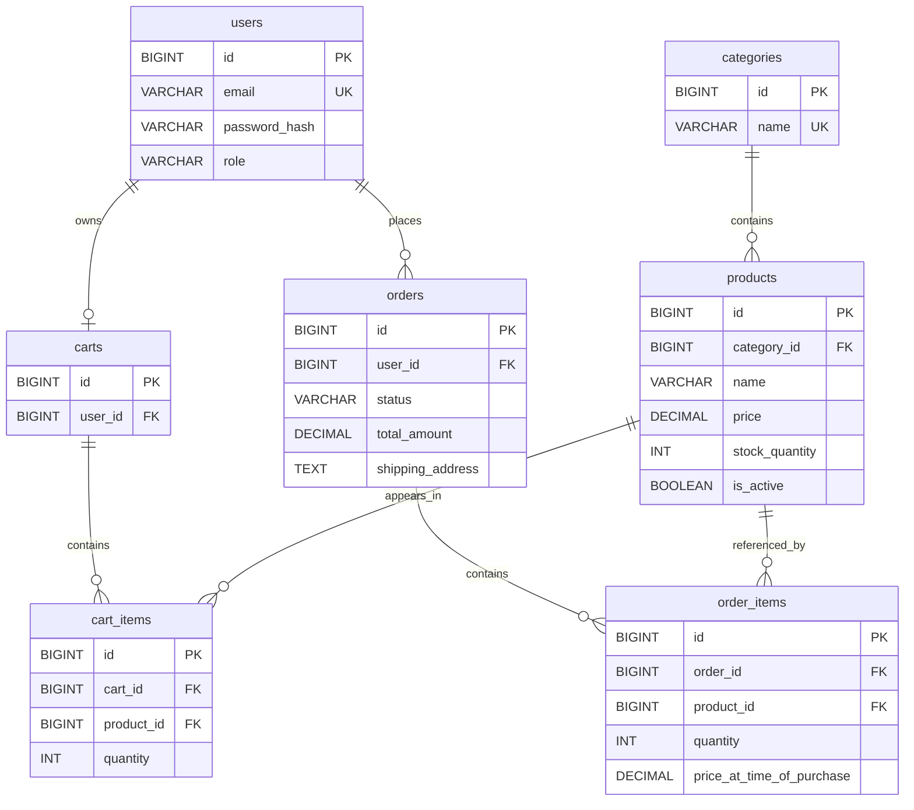

```markdown
# 1. Database Design Overview

The persistence layer for the **Steep & Sip** Tea E-Commerce Platform relies exclusively on a **MySQL (8.x+)** relational database. 

This document defines the physical data model, structural constraints, and integrity rules. The application will interface with MySQL using **Spring Data JPA and Hibernate** as the ORM (Object-Relational Mapping) provider. MySQL is the authoritative persistent data store. Controllers and UI clients have zero direct access to this database; all operations must pass through the Service and Repository layers defined in `02_ARCHITECTURE.md`.

# 2. Database Design Goals

- **Historical Accuracy:** Ensure that changes to the product catalog (e.g., price changes, product deletions) do not alter the integrity of past orders.
- **Data Integrity:** Prevent invalid states (e.g., negative stock, negative prices, orphaned order items) via strict database-level constraints.
- **Simplicity & Maintainability:** Design an accessible MVP schema suitable for a B.C.A. student project, avoiding premature abstractions (like EAV models or microservice data segregation).
- **JPA Compatibility:** Structure tables and relationships so they can be easily and safely mapped using standard JPA annotations (`@Entity`, `@ManyToOne`, `@OneToMany`).
- **Security:** Protect sensitive data (password hashes, user roles) at rest and enforce safe relationship boundaries.

# 3. Database Naming Conventions

The database will follow standard MySQL `snake_case` conventions. These will be mapped to Java `camelCase` by Hibernate automatically.

- **Tables:** Plural, `snake_case` (e.g., `users`, `cart_items`).
- **Columns:** Singular, `snake_case` (e.g., `first_name`, `created_at`).
- **Primary Keys:** Always named `id`.
- **Foreign Keys:** `{singular_target_table_name}_id` (e.g., `user_id`, `product_id`).
- **Indexes:** `idx_{table}_{column}` (e.g., `idx_users_email`).
- **Unique Constraints:** `uq_{table}_{column}` (e.g., `uq_users_email`).

# 4. Entity Inventory

| Entity | Table | Purpose | MVP / Future |
|---|---|---|---|
| **User** | `users` | Stores authentication, roles, and basic profile info. | MVP |
| **Category**| `categories`| Groups products (e.g., "Black Tea", "Teaware"). | MVP |
| **Product** | `products` | Core catalog items including price and stock limits. | MVP |
| **Cart** | `carts` | Represents a user's active shopping session. | MVP |
| **Cart Item**| `cart_items`| Individual products and quantities inside a cart. | MVP |
| **Order** | `orders` | Immutable record of a finalized checkout transaction. | MVP |
| **Order Item**| `order_items`| Immutable snapshot of products purchased in an order. | MVP |

*Note: Entities such as `wishlists`, `reviews`, `payments`, and `addresses` have been intentionally deferred to Version 2/Advanced scope as per `01_PRODUCT_REQUIREMENTS.md`.*

# 5. Entity Relationship Model



**Relationship Breakdown:**

* A `user` has exactly zero or one active `cart`.
* A `user` can place zero to many `orders`.
* A `category` contains zero to many `products`.
* A `cart` contains zero to many `cart_items`. A `cart_item` belongs to exactly one `product`.
* An `order` contains one to many `order_items`. An `order_item` references exactly one `product`.

# 6. Detailed Table Specifications

*(All Primary Keys are `BIGINT AUTO_INCREMENT`)*

# 7. Users Table

**Table Name:** `users`

| Column | Data Type | Nullable | Default | Key | Description |
| --- | --- | --- | --- | --- | --- |
| `id` | BIGINT | No | AI | PK | Primary identifier. |
| `full_name` | VARCHAR(100) | No | None |  | User's display name. |
| `email` | VARCHAR(255) | No | None | UK | Login identifier. Must be unique. |
| `password_hash` | VARCHAR(255) | No | None |  | BCrypt hashed password. |
| `role` | VARCHAR(50) | No | 'ROLE_USER' |  | E.g., 'ROLE_USER' or 'ROLE_ADMIN'. |
| `created_at` | TIMESTAMP | No | CURRENT |  | Account creation timestamp. |

# 8. Categories Table

**Table Name:** `categories`

| Column | Data Type | Nullable | Default | Key | Description |
| --- | --- | --- | --- | --- | --- |
| `id` | BIGINT | No | AI | PK | Primary identifier. |
| `name` | VARCHAR(100) | No | None | UK | E.g., "Green Tea". Must be unique. |
| `description` | TEXT | Yes | None |  | Optional details about the category. |
| `created_at` | TIMESTAMP | No | CURRENT |  | Creation timestamp. |

# 9. Products Table

**Table Name:** `products`

| Column | Data Type | Nullable | Default | Key | Description |
| --- | --- | --- | --- | --- | --- |
| `id` | BIGINT | No | AI | PK | Primary identifier. |
| `category_id` | BIGINT | Yes | None | FK | References `categories(id)`. |
| `name` | VARCHAR(255) | No | None |  | Product name (e.g., "Assam CTC"). |
| `description` | TEXT | No | None |  | Marketing description/brew instructions. |
| `price` | DECIMAL(10,2) | No | None |  | Monetary value. **NO FLOATS.** |
| `stock_quantity` | INT | No | 0 |  | Current physical warehouse stock. |
| `image_url` | VARCHAR(512) | Yes | None |  | Link to product image. |
| `is_active` | BOOLEAN | No | TRUE |  | Soft-delete flag to protect order history. |
| `created_at` | TIMESTAMP | No | CURRENT |  | Creation timestamp. |
| `updated_at` | TIMESTAMP | No | CURRENT |  | Last modified timestamp. |

# 10. Product Variants / Packaging

**Decision:** **Option A (One product = one purchasable SKU).**
To keep the MVP achievable, we will *not* create a complex `product_variants` table. "Darjeeling 100g" and "Darjeeling 250g" will exist as separate rows in the `products` table.
*Why:* A BCA student MVP benefits from direct Product-to-Cart mappings. Adding a variant matrix heavily complicates inventory updates, UI quantity selectors, and API DTOs.

# 11. Inventory Model

**Decision:** Inventory is modeled directly as the `stock_quantity` column within the `products` table.
*Why:* For the MVP, a single warehouse assumption applies. A separate `inventory` table or ledger subsystem is over-engineered. The application service layer will validate `quantity <= stock_quantity` before allowing a checkout.

# 12. Cart Model

**Table Name:** `carts`

| Column | Data Type | Nullable | Default | Key | Description |
| --- | --- | --- | --- | --- | --- |
| `id` | BIGINT | No | AI | PK | Primary identifier. |
| `user_id` | BIGINT | No | None | UK, FK | References `users(id)`. 1 Cart per User. |
| `created_at` | TIMESTAMP | No | CURRENT |  | When the cart was created. |

**Table Name:** `cart_items`

| Column | Data Type | Nullable | Default | Key | Description |
| --- | --- | --- | --- | --- | --- |
| `id` | BIGINT | No | AI | PK | Primary identifier. |
| `cart_id` | BIGINT | No | None | FK | References `carts(id)`. |
| `product_id` | BIGINT | No | None | FK | References `products(id)`. |
| `quantity` | INT | No | 1 |  | Desired purchase amount. |

*Constraint:* `UNIQUE(cart_id, product_id)` ensures a product only appears as one line item in a cart. Adding more simply increments the `quantity`.

# 13. Order Model

**Table Name:** `orders`

| Column | Data Type | Nullable | Default | Key | Description |
| --- | --- | --- | --- | --- | --- |
| `id` | BIGINT | No | AI | PK | Primary identifier. |
| `user_id` | BIGINT | No | None | FK | References `users(id)`. |
| `status` | VARCHAR(50) | No | 'PENDING' |  | PENDING, SHIPPED, DELIVERED. |
| `total_amount` | DECIMAL(10,2) | No | None |  | Authoritative final calculation. |
| `shipping_address` | TEXT | No | None |  | Snapshot of where to ship. |
| `payment_method` | VARCHAR(50) | No | 'COD' |  | Hardcoded 'COD' for MVP. |
| `created_at` | TIMESTAMP | No | CURRENT |  | Time order was placed. |

**Table Name:** `order_items`

| Column | Data Type | Nullable | Default | Key | Description |
| --- | --- | --- | --- | --- | --- |
| `id` | BIGINT | No | AI | PK | Primary identifier. |
| `order_id` | BIGINT | No | None | FK | References `orders(id)`. |
| `product_id` | BIGINT | No | None | FK | References `products(id)`. |
| `quantity` | INT | No | None |  | Amount purchased. |
| `price_at_purchase` | DECIMAL(10,2) | No | None |  | **Crucial:** Captured from product at checkout. |

# 14. Historical Order Integrity

**CRITICAL RULE:** E-commerce systems must not alter historical receipts.

1. **Pricing:** `order_items.price_at_purchase` satisfies this requirement. If the admin updates `products.price` tomorrow, yesterday's orders remain unchanged because they rely on `price_at_purchase`.
2. **Product Deletion:** Admins cannot physically `DELETE FROM products` if the product has been sold, as this would break the `order_items.product_id` foreign key. Instead, the admin toggles `is_active = FALSE` (Soft Delete). The product disappears from the public shop, but past orders render correctly.

# 15. Shipping Address Model

**Decision:** **Option A (Store directly on the `orders` table as TEXT/VARCHAR).**
*Why:* `01_PRODUCT_REQUIREMENTS.md` excludes an Address Book for the MVP. Storing the address payload as a snapshot on the order guarantees historical accuracy. If the user moves to a new house next year, their old receipts will still correctly display the old shipping address.

# 16. Payment Data Model

**Decision:** Omitted.
*Why:* The MVP exclusively utilizes Cash on Delivery (COD). A simple `payment_method` column on the `orders` table suffices. A dedicated `payments` or `transactions` table is deferred until real gateways (Stripe/Razorpay) are introduced in Version 2.

# 17. Order Status Model

**Values:** `PENDING`, `SHIPPED`, `DELIVERED`.

* This is represented as a `VARCHAR(50)` in the DB (mapped to a Java `Enum` in the Entity).
* State transitions (e.g., ensuring an order goes to SHIPPED before DELIVERED) belong in the **Service Layer**, not as complex database triggers.

# 18. Role Model

**Decision:** Simple string column (`role` on `users` table).
*Why:* The MVP only requires `ROLE_USER` and `ROLE_ADMIN`. A dedicated `roles` table and a `user_roles` join table introduce unnecessary complexity for a student project. The simple column integrates perfectly with Spring Security's `SimpleGrantedAuthority`.

# 19. Timestamps and Auditing

* Fields: `created_at` (all core tables), `updated_at` (products only).
* **Generation:** Handled automatically by the Database (`DEFAULT CURRENT_TIMESTAMP ON UPDATE CURRENT_TIMESTAMP`) or via JPA `@CreationTimestamp` and `@UpdateTimestamp`. Do not rely on manual application-level `LocalDateTime.now()` setters.

# 20. Primary Key Strategy

* **Type:** `BIGINT` (maps to Java `Long`).
* **Generation:** `AUTO_INCREMENT` (MySQL) mapping to `GenerationType.IDENTITY` (JPA).
* *Why:* Simplest, fastest approach for MySQL. UUIDs create fragmented indexes in MySQL InnoDB and are overkill for this scope.

# 21. Foreign Key Strategy

* **`users` -> `carts`:** ON DELETE CASCADE. (If a user is deleted, their temporary cart dies).
* **`carts` -> `cart_items`:** ON DELETE CASCADE.
* **`orders` -> `order_items`:** ON DELETE CASCADE. (If an order is destroyed, its items are too).
* **`products` -> `order_items`:** **ON DELETE RESTRICT.** (You cannot delete a product if someone has bought it. You must soft-delete it instead).

# 22. Constraint Strategy

* **`CHECK(price >= 0)`**: Enforced on `products` and `order_items`.
* **`CHECK(stock_quantity >= 0)`**: Enforced on `products`.
* **`CHECK(quantity > 0)`**: Enforced on `cart_items` and `order_items`.
* **Unique Email**: `UNIQUE(email)` on `users`.
* **Cart Uniqueness**: `UNIQUE(user_id)` on `carts`. `UNIQUE(cart_id, product_id)` on `cart_items`.

# 23. Indexing Strategy

* `idx_users_email`: For fast login lookups.
* `idx_products_category`: For rendering category pages efficiently.
* `idx_orders_user`: For users fetching their order history.
* *(Note: MySQL automatically indexes Foreign Keys. No explicit manual indexing is required for FKs).*

# 24. Normalization Strategy

The database targets **3rd Normal Form (3NF)** with explicit, intentional denormalization for order history:

* `total_amount` is stored directly on `orders` (denormalization to avoid recalculating past totals across thousands of order items).
* `shipping_address` and `price_at_purchase` are stored on the order tables to snapshot data in time, rather than referencing live tables that may change.

# 25. Data Integrity Rules

**Database-Enforced (Absolute bottom line):**

* Stock cannot be `< 0`.
* Price cannot be `< 0`.
* Emails must be unique.
* Orphans cannot exist (Foreign Key constraints).

**Service-Layer-Enforced (Context-aware rules):**

* A user cannot add more items to their cart than `products.stock_quantity`.
* Only Admins can modify product data.
* Order totals must be the sum of `order_items.price_at_purchase * quantity`.

**UI-Enforced (User experience):**

* Form fields require valid email syntax.
* Quantity selectors cap at available stock to prevent API errors.

# 26. Concurrency and Inventory Integrity

**The Problem:** Two users try to buy the last unit of "Assam CTC" at the exact same millisecond.
**The Solution:**
The MVP relies on a simple read-and-verify in the Service layer, coupled with a safe database decrement:
`UPDATE products SET stock_quantity = stock_quantity - X WHERE id = Y AND stock_quantity >= X;`
If this query affects 0 rows, the Service layer aborts the checkout transaction and throws an `InsufficientStockException`.
*(No complex optimistic locking `@Version` is strictly required for this student scope if the decrement query is written safely, but it is acceptable if preferred).*

# 27. JPA/Hibernate Mapping Strategy

* **Cart ↔ CartItem:** `@OneToMany(mappedBy = "cart", cascade = CascadeType.ALL, orphanRemoval = true)`.
* **Order ↔ OrderItem:** `@OneToMany(mappedBy = "order", cascade = CascadeType.ALL)`.
* **Product ↔ Category:** `@ManyToOne(fetch = FetchType.LAZY)`.
* **CartItem / OrderItem ↔ Product:** `@ManyToOne(fetch = FetchType.LAZY)`. (Do NOT use cascade here. Deleting a CartItem should never delete a Product).

# 28. Entity Exposure Rules

* **`users.password_hash`**: Must be entirely ignored in API response DTOs.
* **`is_active`**: Should be filtered globally by the Service layer (`findByIsActiveTrue()`) so deleted products never leak into the public catalog UI.

# 29. Sample Data Model

*Conceptual representation of DB state after 1 order:*

* `users`: (1, 'Jane Doe', 'jane@test.com', '$2a$10$...', 'ROLE_USER')
* `categories`: (1, 'Black Tea')
* `products`: (1, 1, 'Assam CTC', 'Strong tea', 500.00, **48**, TRUE) *(Note: Originally 50)*
* `carts`: (Empty, as checkout cleared it)
* `orders`: (1, 1, 'PENDING', 1000.00, '123 Main St', 'COD')
* `order_items`: (1, 1, 1, 2, 500.00)

# 30. Sample Data / Seed Strategy

Use a `data.sql` file placed in `src/main/resources`. Spring Boot will automatically execute this against an empty MySQL database on startup to seed Categories, Admin users, and sample Teas.

# 31. Database Environment Strategy

* **Development/Local:** Spring Boot `application-dev.properties` connects to a local MySQL instance (e.g., `localhost:3306/teastore_dev`). `spring.jpa.hibernate.ddl-auto=update` is acceptable for initial rapid prototyping.
* **Production:** Passwords supplied strictly via environment variables.

# 32. Schema Evolution Strategy

For the initial B.C.A student project phase, rely on Hibernate's schema auto-generation (`ddl-auto=update`).
Explicit migration tools (Flyway/Liquibase) are deliberately **deferred** to avoid unnecessary complexity during the MVP build phase.

# 33. Database-to-Application Mapping

| Database Entity | JPA Entity | Repository | Main Service Responsibility |
| --- | --- | --- | --- |
| `users` | `User` | `UserRepository` | `AuthService` (Login/Registration) |
| `categories` | `Category` | `CategoryRepository` | `CategoryService` (Catalog grouping) |
| `products` | `Product` | `ProductRepository` | `ProductService` (Catalog & Inventory check) |
| `carts`, `cart_items` | `Cart`, `CartItem` | `CartRepository` | `CartService` (Session shopping) |
| `orders`, `order_items` | `Order`, `OrderItem` | `OrderRepository` | `OrderService` (Transactional checkout) |

# 34. Database-to-Product Traceability

| Product Requirement | Database Support |
| --- | --- |
| Customer Accounts | `users` table with `password_hash` |
| Product Catalog | `products` and `categories` tables |
| Prevent Overselling | `products.stock_quantity` + `CHECK` constraint |
| Order History | `orders` + `order_items` tables |
| Historical Pricing | `order_items.price_at_purchase` column |
| Cash on Delivery | `orders.payment_method` column |

# 35. Database Anti-Patterns to Avoid

**Google Antigravity must NOT:**

* Use `FLOAT` or `DOUBLE` for the `price` column. Use `DECIMAL(10,2)`.
* Omit Foreign Key relationships to "save time".
* Forget to set `ON DELETE RESTRICT` for products tied to orders.
* Create a `user_roles` mapping table (overkill for MVP).
* Put business logic (like cart total calculation) inside MySQL Views or Triggers. (The Spring Service layer handles this).
* Store plain text passwords during development/seeding in `data.sql`. (Generate Bcrypt hashes for seed scripts).

# 36. Architectural Boundaries

| Concern | Authoritative Document |
| --- | --- |
| Product requirements | `01_PRODUCT_REQUIREMENTS.md` |
| Technical architecture | `02_ARCHITECTURE.md` |
| **Database schema** | **`03_DATABASE_DESIGN.md`** |
| REST API contracts | `04_API_CONTRACTS.md` |
| Security/authentication | `05_SECURITY_AND_AUTH.md` |
| Implementation state | `06_IMPLEMENTATION_STATUS.md` |
| AI-agent rules | `AGENTS.md` |

*Rule:* If the API Contract requires a field that is missing here, this document must be amended first. This document is the upstream authority for persistence.

# 37. Antigravity Database Development Rules

* **Do not invent new tables.** The MVP scope is strictly defined by Section 4.
* **Maintain DTO Separation.** Do not use the JPA `@Entity` classes as the payload in `@RestController` returns.
* **Respect Historical Data.** Never write an API endpoint that updates `order_items.price_at_purchase` after checkout is finalized.
* **Constraint Adherence.** Ensure JPA `@Column(nullable = false, unique = true)` annotations perfectly mirror the database definitions outlined in Sections 7-13.

# 38. Open Database Decisions

**No significant unresolved database decisions identified.**
The established schema cleanly covers the constraints of `01_PRODUCT_REQUIREMENTS.md` while remaining architecturally simple enough for the initial phase.

# 39. Final Database Design Summary

* **Core Entities:** `users`, `categories`, `products`, `carts`, `cart_items`, `orders`, `order_items`.
* **Keys:** `BIGINT AUTO_INCREMENT` for all PKs.
* **Relationships:** Enforced via strict Foreign Keys. `carts` and `orders` own their items.
* **Historical Strategy:** `order_items` captures a snapshot of `price` at checkout. `orders` captures `shipping_address`. Products use soft-deletes (`is_active`).
* **Inventory Strategy:** Handled entirely by `products.stock_quantity`.
* **Currency:** Strictly `DECIMAL(10,2)`.

# 40. Document Metadata

* **Document Name:** Database Design Document
* **Purpose:** Authoritative definition of MySQL tables, relationships, and persistence constraints.
* **Status:** APPROVED FOR MVP
* **Authority Level:** HIGHEST (For Persistence Layer)
* **Dependencies:** `01_PRODUCT_REQUIREMENTS.md`, `02_ARCHITECTURE.md`
* **Consumers:** API Contracts, Spring Data JPA Implementation, Google Antigravity.
* **Update Policy:** Must be updated before any new table or column is implemented in code.

```

```